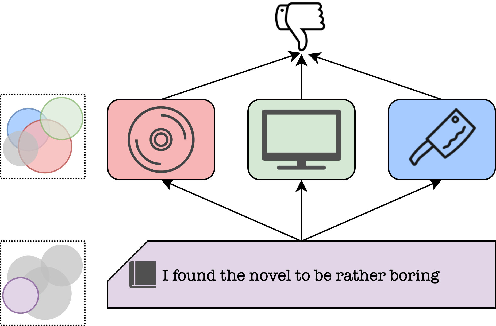

# Transformer Based Multi-Source Domain Adaptation
Dustin Wright and Isabelle Augenstein

To appear in EMNLP 2020. Read the preprint: https://arxiv.org/abs/2009.07806

<p align="center">
  
</p>

In practical machine learning settings, the data on which a model must make predictions often come from a different distribution than the data it was trained on. Here, we investigate the problem of unsupervised multi-source domain adaptation, where a model is trained on labelled data from multiple source domains and must make predictions on a domain for which no labelled data has been seen. Prior work with CNNs and RNNs has demonstrated the benefit of mixture of experts, where the predictions of multiple domain expert classifiers are combined; as well as domain adversarial training, to induce a domain agnostic representation space. Inspired by this, we investigate how such methods can be effectively applied to large pretrained transformer models. We find that domain adversarial training has an effect on the learned representations of these models while having little effect on their performance, suggesting that large transformer-based models are already relatively robust across domains. Additionally, we show that mixture of experts leads to significant performance improvements by comparing several variants of mixing functions, including one novel mixture based on attention. Finally, we demonstrate that the predictions of large pretrained transformer based domain experts are highly homogenous, making it challenging to learn effective functions for mixing their predictions.

# Citing

```bib
@inproceedings{wright2020transformer,
  title={{Transformer Based Multi-Source Domain Adaptation}},
  author={Dustin Wright and Isabelle Augenstein},
  booktitle = {Proceedings of EMNLP},
  publisher = {Association for Computational Linguistics},
  year = 2020
}
```

# Recreating Results

To recreate our results, first download the [Amazon Product Reviews](https://www.cs.jhu.edu/~mdredze/datasets/sentiment/) and [PHEME Rumour Detection](https://figshare.com/articles/PHEME_dataset_for_Rumour_Detection_and_Veracity_Classification/6392078) datasets and place them in the 'data/' directory. For sentiment data place it in a directory called 'data/sentiment-dataset' and for the PHEME data place it in a directory called 'data/PHEME'

Create a new conda environment:

```bash
$ conda create --name xformer-multisource-domain-adaptation python=3.7
$ conda activate xformer-multisource-domain-adaptation
$ pip install -r requirements.txt
```

Note that this project uses wandb; if you do not use wandb, set the following flag to store runs only locally:

```bash
export WANDB_MODE=dryrun
```

## Running all experiments

The files for running all of the experiments are in `run_sentiment_experiments.sh` and `run_claim_experiments.sh`. You can look in these files for the commands to run a particular experiment. Running either of these files will run all 10 variants presented in the paper 5 times. The individual scripts used for each experiment are under `emnlp_final_experiments/claim-detection` and `emnlp_final_experiments/sentiment-analysis`
